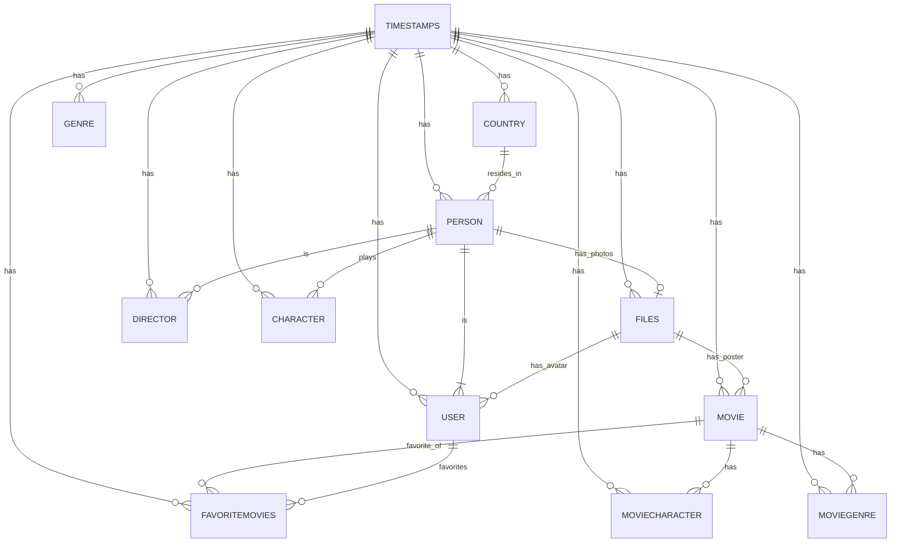

# lecture-starter-db

erDiagram
    TIMESTAMPS {
        INT idTimestamps PK
        TIMESTAMP createdAt
        TIMESTAMP updatedAt       
    }

    COUNTRY {
        INT idCountry PK
        VARCHAR(50) nameCountry
        INT timestamps_idTimestamps FK
    }

    PERSON {
        INT idPerson PK
        VARCHAR(15) firstName
        VARCHAR(15) lastName
        DATE dateOfBirth
        BIT gender
        INT country_idCountry FK
        INT timestamps_idTimestamps FK
        TEXT biography
    }

    FILES {
        INT idFiles PK
        VARCHAR(100) fileName
        VARCHAR(45) mimeType
        VARCHAR(50) key
        VARCHAR(30) url
        INT timestamps_idTimestamps FK
        INT person_idPerson FK
    }

    USER {
        INT idUser PK
        VARCHAR(16) username
        VARCHAR(30) email
        VARCHAR(10) password
        INT timestamps_idTimestamps FK
        INT files_idFiles FK
        VARCHAR(15) firstName
        VARCHAR(15) lastName
    }

    DIRECTOR {
        INT idDirector PK
        INT person_idPerson FK
        INT timestamps_idTimestamps FK
    }

    CHARACTER {
        INT idCharacter PK
        VARCHAR(30) name UNIQUE
        TEXT description
        ENUM role
        INT timestamps_idTimestamps FK
        INT person_idPerson FK
    }

    MOVIE {
        INT idMovie PK
        VARCHAR(40) title UNIQUE
        TEXT description
        DOUBLE budget
        DATE releaseDate
        INT duration
        INT timestamps_idTimestamps FK
        INT files_idFiles FK
        INT director_idDirector FK
        INT country_idCountry FK
    }

    GENRE {
        INT idGenre PK
        VARCHAR(35) name
        INT timestamps_idTimestamps FK
    }

    MOVIEGENRE {
        INT movie_idMovie PK FK
        INT genre_idGenre PK FK
        INT timestamps_idTimestamps FK
    }

    MOVIECHARACTER {
        INT movie_idMovie PK FK
        INT character_idCharacter PK FK
        INT timestamps_idTimestamps FK
    }

    FAVORITEMOVIES {
        INT movie_idMovie PK FK
        INT user_idUser PK FK
        INT timestamps_idTimestamps FK
    }

    TIMESTAMPS ||--o{ COUNTRY : has
    TIMESTAMPS ||--o{ PERSON : has
    TIMESTAMPS ||--o{ FILES : has
    TIMESTAMPS ||--o{ USER : has
    TIMESTAMPS ||--o{ DIRECTOR : has
    TIMESTAMPS ||--o{ CHARACTER : has
    TIMESTAMPS ||--o{ MOVIE : has
    TIMESTAMPS ||--o{ GENRE : has
    TIMESTAMPS ||--o{ MOVIEGENRE : has
    TIMESTAMPS ||--o{ MOVIECHARACTER : has
    TIMESTAMPS ||--o{ FAVORITEMOVIES : has

    COUNTRY ||--o{ PERSON : resides_in
    PERSON ||--o| FILES : has_photos
    PERSON ||--|{ USER : is

    PERSON ||--o{ DIRECTOR : is
    PERSON ||--o{ CHARACTER : plays

    MOVIE ||--o{ MOVIECHARACTER : has
    MOVIE ||--o{ MOVIEGENRE : has
    MOVIE ||--o{ FAVORITEMOVIES : favorite_of

    USER ||--o{ FAVORITEMOVIES : favorites

    FILES ||--o{ USER : has_avatar
    FILES ||--o{ MOVIE : has_poster

